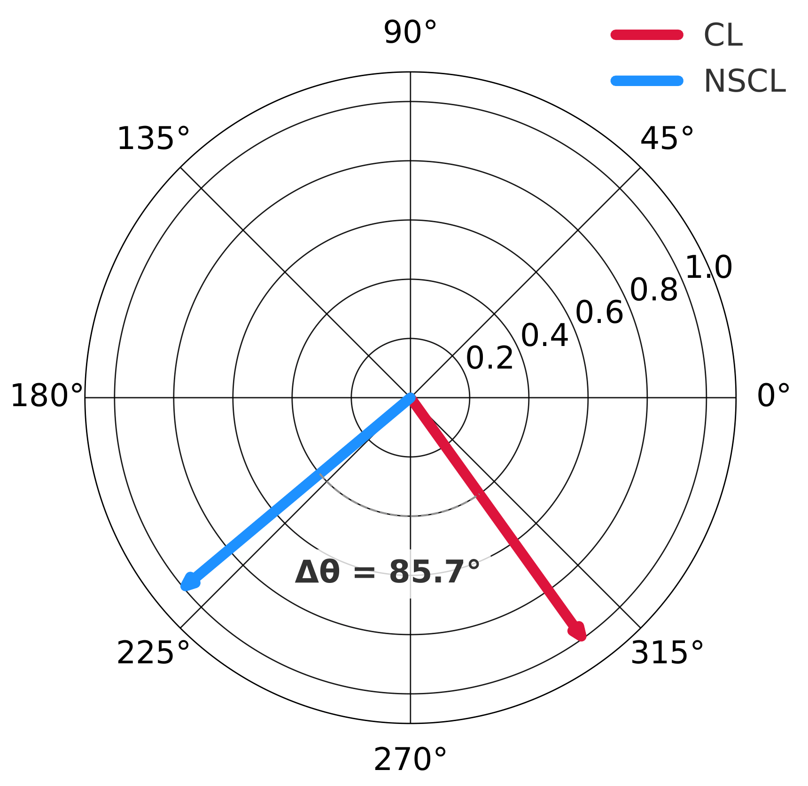
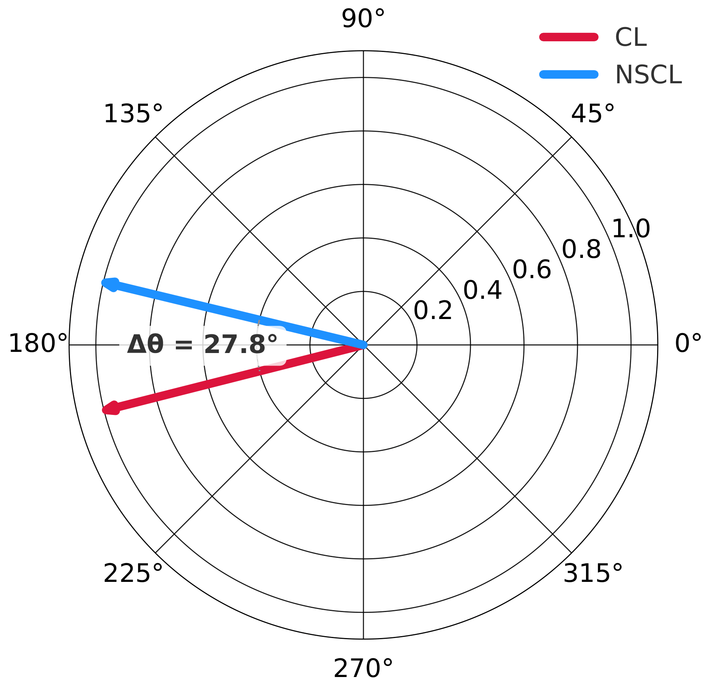

# ON THE ALIGNMENT BETWEEN SELF-SUPERVISED AND SUPERVISED LEARNING
[Preprint]() | [Project Page](https://dlfundamentals.github.io/cl-nscl-representation-alignment/)

In this work we make progress towards addressing the following question:

> **Do contrastive and supervised models remain aligned throughout training, not just at the level of their objectives?**

<div align="center">
  
  
  <p>Corresponds to Figure 1 in paper: Comparison of weight-space (left) and representation-space (right) alignment.</p>
</div>

We acknowledge the following works for their open-source contributions:

* [SimCLR](https://github.com/google-research/simclr)
* [SimCLR PyTorch](https://github.com/Spijkervet/SimCLR/tree/master)

## Abstract

Self-supervised contrastive learning (CL) has achieved remarkable empirical success, often producing representations that rival supervised pre-training on downstream tasks. Recent theory explains this by showing that the CL loss closely approximates a supervised surrogate, Negatives-Only Supervised Contrastive Learning (NSCL) loss, as the number of classes grows. Yet this loss-level similarity leaves an open question: <ins>_Do CL and NSCL also remain aligned at the representation level throughout training, not just in their objectives?_</ins>

We address this by analyzing the representation alignment of CL and NSCL models trained under shared randomness (same initialization, batches, and augmentations). First, we show that their induced representations remain similar: specifically, we prove that the similarity matrices of CL and NSCL stay close under realistic conditions. Our bounds provide high-probability guarantees on alignment metrics such as centered kernel alignment (CKA) and representational similarity analysis (RSA), and they clarify how alignment improves with more classes, higher temperatures, and its dependence on batch size. In contrast, we demonstrate that parameter-space coupling is inherently unstable: divergence between CL and NSCL weights can grow exponentially with training time.

Finally, we validate these predictions empirically, showing that CL–NSCL alignment strengthens with scale and temperature, and that NSCL tracks CL more closely than other supervised objectives. This positions NSCL as a principled bridge between self-supervised and supervised learning.

## Installation

To get started, follow these steps:

```bash
git clone https://github.com/DLFundamentals/understanding_ssl_v2.git
cd understanding_ssl_v2
```

The packages that we use are straightforward to install. Please run the following command:

```bash
conda env create -f requirements.yml
conda activate alignment
```

## Pretraining models with shared randomness

To pretrain models with shared randomness, you can run the following command:

```bash
torchrun --nproc_per_node=N_GPUs --standalone scripts/parallel_train_simclr.py \
--config <path-to-config-file>
```

For example,

```bash
torchrun --nproc_per_node=N_GPUs --standalone scripts/parallel_train_simclr.py \
--config configs/mini_imagenet_resnet50.yaml
```

> **Note:** We provide config files for all the datasets that we used in our work. You can locate them in `configs/` directory.

Replace `N_GPUs` with the number of GPUs you want to use and `<path-to-yaml-config>` with the path to your configuration file.

Please refer to [docs/pretraining](https://github.com/DLFundamentals/understanding-ssl/blob/main/docs/pretraining.md) for more details.

## Representation alignment evaluation

To study alignment in representation space, we use widely-used standardized metrics: [Representation Similarity Analysis](https://www.frontiersin.org/journals/systems-neuroscience/articles/10.3389/neuro.06.004.2008/full) (RSA) and [Centered Kernel Alignment](https://arxiv.org/abs/1905.00414) (CKA). To get RSA/CKA values for train and test dataset with all four models (CL, NSCL, SCL, and CE), run:

```bash
python scripts/alignment_eval.py \
    --config <path-to-config-file> \
    --ckpt_path <path-to-all-checkpoints-directory> \
    --output_path <path-to-save-metrics>
```

For example:
```bash
python scripts/alignment_eval.py \
    --config configs/mini_imagenet_resnet50.yaml \
    --ckpt_path checkpoints/cifar100_parallel \
    --output_path results/cifar100/alignment
```

> **Note:** We have hard-coded `RSA` and `CKA` flags in `alignment_eval.py`. You can find them on L59-60. Feel free to switch them as per requirements.

This shall generate two files at the end of a successful run: `train_alignment.csv` and `test_alignment.csv` with RSA and CKA values for provided models in `--ckpt_path` directory. You can analyse the alignment metrics during training and conclude which supervised method aligns the most with contrastive learning! (It's NSCL 👀)

We study various factors such as #classes ($C$), temperature ($\tau$), and batch-size ($B$) that affect alignment between CL and NSCL models. Please refer to [docs/evaluation](https://github.com/DLFundamentals/understanding-ssl/blob/main/docs/evaluation.md) scripts for reproducing additional experiments shown in our paper.

## Parameters alignment evaluation aka weight-space coupling


To get average weight gap between different models, run:

```bash
python scripts/weight_space_coupling.py \
    --ckpt_path <path-to-all-checkpoints-directory> \
    --compare <chose between 'cl', 'nscl', 'scl', 'ce> \
    --output_file <path-to-save-metrics>
```

## Figure 3: N-way RSA/CKA analysis

First, we need to pre-train models with shared randomness on the desired dataset. After that, to get N-way RSA/CKA values for train and test dataset with all four models (CL, NSCL, SCL, and CE), run:

```bash
bash bash/run_n_way_training.sh <config-path> <dataset-name>
```

After pretraining, to evaluate the N-way alignment, run:

```bash
bash bash/run_n_way_alignment_eval.sh <config-path> <ckpt-path> <output-path> <classes-per-dataset> <dataset-name>
```

## Figure 4: Varying temperature

To pretrain models with different temperature values, repeat the steps for [pretraining-models-parallelly]() and set different temperature values in the config file.

## Figure 5: Varying batch-size and learning rate

To pretrain models with different batch-size and learning rate values, repeat the steps for [pretraining-models-parallelly]() and set different batch-size and learning rate values in the config file.

## Figure 6: Weight-space coupling

To get average weight gap between different models, run:

```bash
python scripts/weight_space_coupling.py \
    --ckpt_path <path-to-all-checkpoints-directory> \
    --compare <chose between 'cl', 'nscl', 'scl', 'ce> \
    --output_file <path-to-save-metrics>
```


## 📚 Citation

If you find our work useful in your research or applications, please cite us using the following BibTeX:

```bibtex
@misc{clnscl2025alignment,
  title={On the Alignment Between Supervised and Self-Supervised Contrastive Learning},
  author={Luthra, Achleshwar and Mishra, Priyadarsi and Galanti, Tomer},
  booktitle={arXiv},
  year={2025},
  url={}
}

```